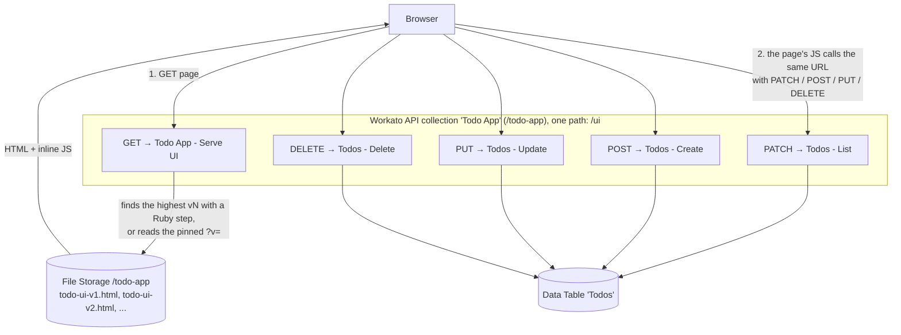

# Workato-only todo app

A todo app that runs entirely inside Workato. There is no server, framework or outside hosting:

- **Frontend:** one plain HTML file stored in Workato File Storage
- **Database:** a Workato Data Table
- **Backend:** Workato recipes, mostly simple CRUD calls to the table
- **Hosting:** one Workato API collection serves both the page and the API on the same URL

## Open the app

<https://apim.workato.com/anz-presales/todo-app/ui?api_token=REDACTED_API_TOKEN>

Add, tick off and delete todos. Anyone with the link can use it.

The link contains an API token. Workato keeps everything private by default, so the token is what lets a public page work. Share the link only with people who should edit the list. You can revoke the token to switch the app off. See [Access](#access).

### Pick a UI version

The UI files are versioned (`todo-ui-v1.html`, `todo-ui-v2.html`, ...). Add `&v=` to the link:

| Link | Shows |
|---|---|
| no `v`, or `&v=latest` | the highest version in File Storage |
| `&v=v1` | exactly `todo-ui-v1.html` |

## Publish a new UI version

1. Edit a copy of the newest `todo-ui-vN.html` in this repo and save it as `todo-ui-v{N+1}.html`.
2. Upload it to `/todo-app/todo-ui-v{N+1}.html` in [Workato File Storage](https://app.workato.com/files/management?directory_path=%2Ftodo-app). You can upload in the Workato UI (how v3 was published), or use a recipe with the `workato_files` `store_file` action. That action was tested on 2026-09-30 and works into an existing folder (see `template.md`).
3. Reload the link. The app serves the highest version automatically. There is no "latest" file or manifest to update.
4. To roll back, open `&v=vN` for an older version, or upload a higher version with the old content.

## How it works



The browser loads the page with a `GET`. After that, everything the page does (list, add, complete, delete) is its own JavaScript calling `fetch()` on the same URL with a different HTTP method. Same origin, same path, so there is no CORS setup.

Listing uses `PATCH` because `GET` is already taken by the page.

| Method | Recipe | What it does |
|---|---|---|
| `GET` | `Todo App - Serve UI` | Picks an HTML file from File Storage and returns it as `text/html`. A short Ruby step finds the highest `vN`. |
| `PATCH` | `Todos - List` | Reads all rows from the `Todos` table |
| `POST` | `Todos - Create` | Inserts a row |
| `PUT` | `Todos - Update` | Updates a row |
| `DELETE` | `Todos - Delete` | Deletes a row by id |

## Where everything lives

| Piece | Link |
|---|---|
| Frontend HTML (File Storage, `/todo-app`) | [File Storage](https://app.workato.com/files/management?directory_path=%2Ftodo-app) |
| Database (Data Table `Todos`, id `141793`) | [Data table](https://app.workato.com/data_tables/141793) |
| Recipes and project folder (`Todo App Custom UI`, folder `35033143`) | [Project](https://app.workato.com/recipes?fid=35033143&canvas_page_id=cpg-AbPhc6To-JGogtB-CD#assets) |
| API collection and endpoints (`Todo App`, id `1393729`) | [Endpoints](https://app.workato.com/api_groups/1393729/endpoints) |

Recipe ids: `Todo App - Serve UI` `81419527`, `Todos - List` `81412451`, `Todos - Create` `81416563`, `Todos - Update` `81416601`, `Todos - Delete` `81416713`.

In this repo:

| Path | What it is |
|---|---|
| `todo-ui-v1.html`, `todo-ui-v2.html`, `todo-ui-v3.html` | Local copies of the UI files uploaded to File Storage. v1 and v2 hard-code the token; v3 reads it from the page URL |
| `manifests/todo-app-v2.0/` (and `.zip`) | Export of the whole Workato project (recipes, table, API collection, endpoints) |
| `template.md` | Instructions for an agent to find every moving part, or build a new app like this one |
| `changelog.md` | Version notes |

## Access

- The app and its API sit in one API collection. Workato API Platform authenticates every request, so a dedicated client (`Todo Public Website`) and access profile (`Public UI only`, scoped to the `Todo App` collection only) issue an API token.
- The token goes in the link as `?api_token=...`. The page's JavaScript passes it on to each API call, so opening the link is all a user needs to do. The initial page load needs the token too, since a link can't carry headers.
- Anyone with the link can read and write the shared list. To stop access, revoke or rotate the token in Workato API Platform. Don't reuse this client or token for anything else.
- This is the current setup, not a fixed design. The auth method may change.

## Quirks worth knowing

Full detail is in `template.md`. In short:

- The API collection's URL slug (`todo-app`) and each endpoint's path (`ui`) can only be set by hand in the Workato UI, not through the management API.
- There is no Workato management (dev) API for File Storage. A recipe can write a file with `store_file`, but only into a folder that already exists (it fails with "Directory not found" otherwise). Folders are created by hand in the File Storage UI; `/todo-app` was made that way.
- Recipes triggered by the API Platform don't support `else`. The recipes use two `if` blocks with opposite conditions instead.
- List and create/update responses (`records_json`, `record_json`) are Ruby-style strings rather than real JSON. The page includes a small `parseRubyHash()` function to convert them.
- Update needs both `title` and `completed` every time, because both columns are required.

## Verify

```sh
TOKEN="REDACTED_API_TOKEN"
URL="https://apim.workato.com/anz-presales/todo-app/ui"

curl -i "$URL?api_token=$TOKEN"             # page, latest version
curl -i "$URL?api_token=$TOKEN&v=v1"        # page, pinned to v1
curl -s -X PATCH "$URL?api_token=$TOKEN"    # list todos
```

The page requests return HTTP 200 with `Content-Type: text/html; charset=utf-8`. The list call returns `{"records_json":"[...]"}` with the current todos.

## Build another app like this

Give `template.md` to an agent. It lists every asset and ID for this app, then walks through creating a new one with the Workato dev API and Airo.
