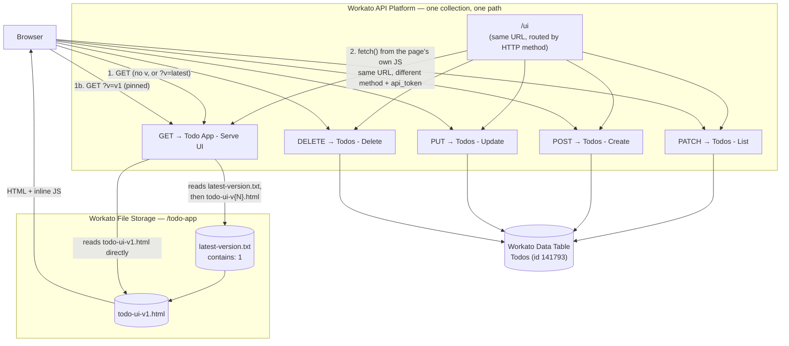

# Workato-only public todo app

A todo app that runs entirely inside Workato's API Platform: one API collection, one route (method-routed), a UI page served from Workato File Storage with real version resolution, and data persisted in a Workato Data Table. No servers, frameworks, or hosting outside Workato.

Public link:

<https://apim.workato.com/anz-presales/todo-app/ui?api_token=REDACTED_API_TOKEN>

## Architecture



**Web perspective:** the browser does a plain `GET` on the public link to load the page. Everything after that — listing, adding, completing, deleting todos — is the page's own inline `<script>` calling `fetch()` back against the *exact same URL*, just with a different HTTP method (`PATCH`/`POST`/`PUT`/`DELETE`) and the same `api_token` query param. Same origin, same path, method-routed — no CORS to configure.

**Workato perspective:** one API collection (`Todo App`) holds one path (`/ui`, set by hand in the Workato UI — see "Known quirks"). Five recipes are bound to that one path, each on a different HTTP method:

| Method | Recipe | What it does |
|---|---|---|
| `GET` | `Todo App - Serve UI` | Resolves `?v=` to a real HTML file in File Storage and returns it as `text/html` |
| `PATCH` | `Todos - List` | Reads all rows from the `Todos` Data Table |
| `POST` | `Todos - Create` | Inserts a row |
| `PUT` | `Todos - Update` | Updates a row (title + completed, both required — see quirks) |
| `DELETE` | `Todos - Delete` | Deletes a row by id |

## Versioning (`?v=`)

UI files live in Workato File Storage under `/todo-app`, named `todo-ui-v{N}.html` — a real, growing sequence of immutable snapshots (`todo-ui-v1.html`, `todo-ui-v2.html`, ...). There is **no duplicated "latest" copy** — the recipe genuinely resolves the highest version at request time via a manifest file:

- `?v=v1` (or any `?v=vN`) → reads `/todo-app/todo-ui-vN.html` directly.
- `?v=latest` or the param omitted entirely → the recipe first reads `/todo-app/latest-version.txt` (a one-line manifest containing just the current highest version number, e.g. `1`), then reads `/todo-app/todo-ui-v{that number}.html`.

**To publish a new UI version:** upload `/todo-app/todo-ui-vN.html` (the new snapshot) and overwrite `/todo-app/latest-version.txt` with `N`, via the `workato_files.store_file` action, done directly through Workato (there's no public deploy endpoint — kept out of scope for the public token intentionally).

## Known quirks (read before touching recipes/endpoints)

- **API endpoint paths and the collection's URL slug are not editable via the management API** — `put_api_collections_` only exposes `name`/`proxy_connection_id`/`public_access`, and the endpoints PUT call has no field for a custom path. Both the collection slug (`todo-app-v1` → `todo-app`) and each endpoint's path (auto-generated `api_collections/{id}/api_endpoints` → `ui`) were changed by hand in the Workato UI, not through the API. Endpoints created via the management API still land on the auto-generated path by default.
- **Workato File Storage folders can't be created via the API or any recipe action.** Only `store_file` (write) and `get_file_contents` (read) are exposed — no `create_folder`, no `list_files`. The `/todo-app` folder was created once, manually, in the Workato UI.
- **`else` blocks don't work in API-Platform-triggered recipes** (confirmed by repeated testing — every structural variant of an `else` action, including a minimal one copied verbatim from a working example elsewhere in the account, fails recipe validation with `"unexpected line"`). The version-resolution logic uses **two independent `if` blocks** with complementary conditions instead of `if`/`else`. Condition operands also use Workato's own vocabulary (`equals_to`, `not_equals_to`, `blank`, `present`, ...) — not the more obvious `equals`.
- **The CRUD API's JSON responses aren't real JSON.** `records_json` / `record_json` are Ruby's `Hash#inspect` string format (`"key"=>value`, `nil`, unquoted timestamps), not `JSON.stringify` output. The page's client JS includes a small `parseRubyHash()` converter that normalizes this into real JSON before `JSON.parse()`.
- **`Create`/`Update` require `title` and `completed` on every request**, even though the public API schema marks them optional — the underlying Data Table columns are non-optional, so a partial update (e.g. just toggling `completed`) still needs `title` resent.
- **Boolean fields need an explicit `boolean_conversion` hint** on the recipe's pill (`render_input`/`parse_output`), or the Data Table connector rejects the value as `expected type boolean, got: string`.
- **Trigger request fields are nested one level under `request`** in the pill data actually available at runtime (`request.v`, not `v`), even though the trigger's own visible schema doesn't show that nesting by default — recipes built by hand need a matching `extended_output_schema` declaration on the trigger for the pill to validate.

## Workato assets

- API collection: `Todo App` (`1393729`, url slug `todo-app`) — the only collection now
- Recipes: `Todo App - Serve UI` (`81419527`), `Todos - List` (`81412451`), `Todos - Create` (`81416563`), `Todos - Update` (`81416601`), `Todos - Delete` (`81416713`)
- Data table: `Todos` (`141793`)
- File storage: `/todo-app/todo-ui-v1.html`, `/todo-app/latest-version.txt`
- API client: `Todo Public Website` (`1270569`)
- Access profile: `Public UI only` (`1356466`) — scoped to the `Todo App` collection only

**Retired (not deleted, kept disabled for now):** collection `Todo App API` (`1385483`, the old `todo-app-api-v1` slug) and its 5 endpoints; and orphaned root-level file-storage files (`/todo-ui-v1.html`, `/todo-ui-latest.html`, `/todo-ui-.html`) from an earlier iteration before the `/todo-app` folder existed — harmless leftovers, safe to delete by hand in the Workato UI if you want a fully clean slate (no delete-file action is exposed via the API).

## Important limitation

This is publicly reachable by possession of the link, rather than a truly anonymous endpoint. Workato API Platform still authenticates the request, so the token is included as the `api_token` query parameter and is also embedded in the served page's JS (needed for the browser to call the CRUD API directly). Anyone with the link or page source can read and write the shared todo list. Treat the token as a public, revocable site key — rotate or revoke it when the link should stop working, and don't reuse this client/token for anything beyond this demo.

## Verify

```sh
TOKEN="REDACTED_API_TOKEN"
URL="https://apim.workato.com/anz-presales/todo-app/ui"

curl -i "$URL?api_token=$TOKEN"             # page, defaults to latest (via manifest)
curl -i "$URL?api_token=$TOKEN&v=v1"        # page, pinned to v1
curl -s -X PATCH "$URL?api_token=$TOKEN"    # list todos
```

Expected result: the page requests return HTTP 200 with `Content-Type: text/html; charset=utf-8`; the list call returns `{"records_json":"[...]"}` with the current todos.
